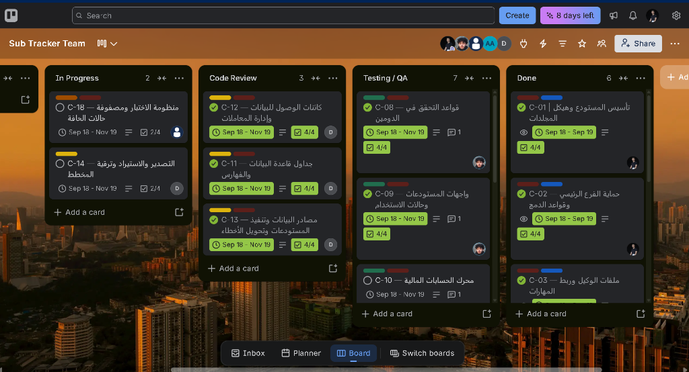

# Sub Tracker — متتبّع الاشتراكات والالتزامات الدورية 📊💳

<p align="center">
  
</p>

<p align="center">
  <strong>الجمهورية اليمنية — وزارة التعليم العالي والبحث العلمي</strong><br>
  <strong>جامعة إب — كلية علوم الحاسوب وتكنولوجيا المعلومات — قسم هندسة البرمجيات</strong><br>
  <em>مشروع مقرر هندسة البرمجيات النظري والتطبيقي — العام الجامعي 2026/2027م</em>
</p>

<p align="center">
  
  
  
  
  
  
  
  
</p>

---

## 👨‍🏫 إشراف 
**المهندس القدير: م. ساهر الهمداني**  
*أستاذ ومحاضر مقرر هندسة البرمجيات — جامعة إب*

---

## 👥 فريق العمل وتوزيع الأدوار الهندسية (CODEOWNERS)

تم توزيع المهام والمسؤوليات الهندسية على أعضاء الفريق وفق نظام حوكمة صارم معتمد في ملف `.github/CODEOWNERS`:

| العضو | حساب GitHub | الدور الهندسي والمسؤولية المعتمدة | المسار المسؤول عنه في المستودع |
| :--- | :--- | :--- | :--- |
| **قحطان الشاجع** | [@QahtanAlshagea](https://github.com/QahtanAlshagea) | **قائد الفريق والمشرف المعماري:** هندسة النظام، حوكمة الوكلاء وملفات التوجيه، التوثيق الهندسي، والمراجعة المركزية لكافة طلبات الدمج. | `docs/`, `.agents/`, `GEMINI.md`, `*` |
| **محمد العيدروس** | [@Eng-Mohammed-Al-aidrous](https://github.com/Eng-Mohammed-Al-aidrous) | **مسؤول طبقة النطاق (Domain Layer):** بناء الكيانات الرياضية، كائنات القيمة، حالات الاستخدام، واجهات المستودعات، والقيود المحاسبية. | `lib/features/*/domain/` |
| **أواب النزيلي** | [@AWNO-1](https://github.com/AWNO-1) | **مسؤول طبقة العرض والواجهات (Presentation Layer):** الشاشات، الودجات، إدارة الحالة والتفاعل، التجاوب، ومنظومة اللغات والتعريب. | `lib/features/*/presentation/`, `l10n/` |
| **محمد العواضي** | [@dragongold2022-design](https://github.com/dragongold2022-design) | **مسؤول طبقة البيانات والتخزين (Data & Persistence Layer):** جداول Drift/SQLite، كائنات الوصول للبيانات (DAOs)، والمعاملات الذرية. | `lib/features/*/data/` |
| **مشعل حاجب** | [@mshalhajep](https://github.com/mshalhajep) | **مسؤول ضمان الجودة ومنظومة الاختبارات (QA & Testing Suite):** هرم الاختبارات، تغطية حالات الحافة (151 حالة)، والفحص الساكن الصارم. | `test/` |

---

## 💡 فكرة المشروع وعلاج المشكلة (The Concept & Problem Statement)

يعاني مستخدمو الخدمات الحديثة من ظاهرة **«تراكم الاشتراكات الصامت» (Subscription Creep)**؛ حيث تتوزع الالتزامات المالية المتكررة (فواتير كهرباء، مياه، اتصالات، إنترنت منزلي، إيجار سكن، برمجيات سحابية، ترفيه) على مدار الشهر بتواريخ متفرقة وعملات مختلفة، مما يترتب عليه:
1. **النزيف المالي غير المحسوب** بدفع مبالغ مقابل خدمات غير مستخدمة.
2. **غرامات التأخير وانقطاع الخدمات** بسبب النسيان وتشتت التنبيهات.
3. **انتهاك الخصوصية** في معظم التطبيقات السحابية التي تشترط رفع البيانات المالية الحساسة لخوادم خارجية.

### 🛡️ الحل الهندسي في Sub Tracker:
تطبيق متكامل مبني بفلسفة **الخصوصية أولاً دون اتصال بالإنترنت (Offline-First Privacy-by-Design)**:
- **صفر أذونات إنترنت:** لا يطلب التطبيق إذن الإنترنت نهائياً، مما يستحيل معه تسريب بيانات المستخدم.
- **تأمين محلي فائق بـ PIN:** تشفير الرمز السري محلياً بخوارزمية SHA-256 مع حظر مؤقت بعد 5 محاولات خاطئة لمنع هجمات التخمين.
- **حساب المكافئات بدقة:** تحويل كافة الالتزامات (أسبوعية، شهرية، سنوية، مخصصة) إلى أساس شهري وسنوي موحد مع التقيد الصارم بقاعدة العملات (عدم جمع عملات مختلفة في رقم واحد).
- **الاسترجاع والتراجع:** شريط تراجع (Undo Snackbar) لمدة 5 ثوانٍ بعد الحذف، وتأكيد كتابي لكلمة «مسح» قبل تصفير البيانات.
- **النسخ الاحتياطي المشفر:** تصدير واستيراد البيانات كملفات JSON مشفرة مع خيارات الدمج أو الاستبدال.

---

## 🏗️ المعمارية البرمجية ومبادئ التصميم (Clean Architecture & SOLID)

يتبع النظام معمارية الطبقات النظيفة الصارمة مع قاعدة التبعية للداخل (Inward Dependency Rule):

```
┌─────────────────────────────────────────────────────────────┐
│                 PRESENTATION LAYER (العرض)                   │
│   Screens · Widgets · ViewState (Data/Loading/Empty/Error)  │
│   Formatters · Arabic Pluralization · fl_chart Visuals      │
└──────────────────────────────┬──────────────────────────────┘
                               │ calls UseCases
┌──────────────────────────────▼──────────────────────────────┐
│           DOMAIN LAYER (النطاق — PURE DART 100%)            │
│   Entities · Value Objects (Money, Pin) · Failures          │
│   Repository Interfaces (Abstract Contracts) · UseCases     │
└──────────────────────────────▲──────────────────────────────┘
                               │ implements interfaces
┌──────────────────────────────┴──────────────────────────────┐
│                  DATA LAYER (البيانات والتخزين)              │
│   Drift Tables · DAOs · LocalDataSources · SQLite Engine    │
│   Atomic Transactions · Price History Audit Trail           │
└─────────────────────────────────────────────────────────────┘
```

### تطبيق مبادئ SOLID الخمسة:
- **Single Responsibility (SRP):** كل فئة لها غرض وحيد؛ UseCases معزولة عن التخزين وعن الواجهات.
- **Open/Closed (OCP):** النظام مفتوح للإضافة عبر الواجهات، ومغلق أمام التعديل العنيف على الشيفرات القائمة.
- **Liskov Substitution (LSP):** استبدال المستودعات الملموسة بنسخ تجريبية (Mocks) دون كسر عقود الدومين.
- **Interface Segregation (ISP):** واجهات عقود صغيرة ودقيقة ومحددة الوظائف (`SecurityRepository`, `SubscriptionRepository`).
- **Dependency Inversion (DIP):** حالات الاستخدام في الدومين تعتمد فقط على واجهات مجردة، ويتم الحقن في Composition Root (`lib/core/di/`).

---

## 🚀 قابلية التوسع والميزات المستقبلية (Future Extensibility)

تم تصميم النظام ليتسع للميزات الكبرى دون كسر الطبقات القائمة:
1. **المزامنة السحابية المشفرة متعددة الأجهزة (Multi-Device Cloud Sync):** إضافة `CloudSyncRemoteDataSource` و `ConflictResolutionPolicy` دون لمس الدومين.
2. **المصادقة الحيوية بالبصمة والوجه (Biometric Authentication):** توسيع خدمة الأمان عبر `BiometricAuthService` و `LocalBiometricsAdapter`.
3. **المسح الذكي للفواتير عبر الذكاء الاصطناعي (On-Device OCR Bill Scanner):** استخراج بيانات الفاتورة الورقية محلياً بـ `OnDeviceBillDocumentScanner`.
4. **التكامل مع تقويم النظام والتنبيهات (System Calendar & Alarms):** جدولة المواعيد في تقويم الهاتف الأصلي بـ `NativeCalendarManager`.
5. **التحليل التنبؤي للإنفاق واكتشاف الشذوذ (Predictive Spending Analytics):** التنبؤ بنفقات 6 أشهر قادمة واكتشاف القفزات السعرية بـ `FinancialForecastingEngine`.

---

## 📱 الكتالوج المرئي لشاشات التطبيق (Visual Walkthrough)

يحتوي مجلد `img/` على 17 لقطة شاشة توثق كافة تفاعلات التطبيق:
1. `5881812211724914750_121.jpg` — شاشة المصادقة وقفل PIN السري (4 أرقام مشفرة بـ SHA-256).
2. `5881812211724914751_121.jpg` — شاشة الحظر الأمني المؤقت (Lockout) لمدة 30 ثانية بعد 5 أخطاء.
3. `5881812211724914752_121.jpg` — منتقي الوقت (Time Picker) لتحديد موعد التنبيه اليومي.
4. `5881812211724914753_121.jpg` — نموذج إضافة التزام مالي جديد بجميع محدداته المحاسبية.
5. `5881812211724914754_121.jpg` — نافذة إضافة فئة مخصصة مع منتقي الأيقونات ولوحة الألوان.
6. `5881812211724914755_121.jpg` — الشاشة الرئيسية وقائمة بطاقات الاشتراكات النشطة.
7. `5881812211724914756_121.jpg` — تخصيص الدورية بالأيام وإعدادات التنبيه المسبق.
8. `5881812211724914757_121.jpg` — التحقق الصارم من المدخلات ورسائل التحذير والخطأ الفورية.
9. `5881812211724914758_121.jpg` — البحث الفوري والتصفية اللحظية مع كتابة الحروف.
10. `5881812211724914759_121.jpg` — شاشة الملخص المالي وعرض المكافئ الشهري والسنوي والاشتراك الأعلى تكلفة.
11. `5881812211724914760_121.jpg` — الرسم البياني الدائري التفاعلي لتوزيع المصروفات (`fl_chart`).
12. `5881812211724914761_121.jpg` — التفاعل اللمسي وتكبير شرائح الرسم البياني وعرض تفاصيل الفئة.
13. `5881812211724914762_121.jpg` — شاشة الإعدادات الشاملة (المظهر الفاتح/الداكن، العملة، الأمان، النسخ الاحتياطي).
14. `5881812211724914763_121.jpg` — نافذة تأكيد مسح البيانات الصارمة واشتراط كتابة كلمة «مسح».
15. `5881812211724914764_121.jpg` — نافذة تأكيد حذف الالتزام المالي مع ذكر اسمه صراحة لمنع الأخطاء.
16. `5881812211724914765_121.jpg` — شريط التراجع الفوري عن الحذف (Undo Action Snackbar) لمدة 5 ثوانٍ.
17. `5881812211724914766_121.jpg` — لوحة الفرز والترتيب المتقدم للاشتراكات حسب السعر، الاستحقاق، والأبجدية.

---

## 📊 إدارة المهام ولوحة كانبان (Trello / Kanban)

تمت إدارة وتوزيع مهام المشروع عبر 18 بطاقة كانبان (`C-01` إلى `C-18`) غطت مراحل التأسيس، وحماية الفروع، وتوجيه الوكلاء، والدومين، وقواعد البيانات، والواجهات، ومنظومة الاختبارات، وبناء الحزمة التنفيذية.

<p align="center">
  
</p>

---

## 🧪 منظومة الاختبارات وضمان الجودة (QA & Testing)

- **مجموع الاختبارات المؤتمتة:** أكثر من 525 اختباراً ناجحاً بنسبة 100%.
- **تغطية حالات الحافة:** 151 حالة حافة موثقة ومختبرة بنجاح (معالجة 29 فبراير، الشهر الأقصر، حظر PIN، تقريب الكسور).
- **الفحص الساكن (Static Analysis):** خلو المشروع تماماً من أي خطأ أو تحذير ساكن (`flutter analyze --fatal-infos` -> Clean).
- **التنسيق القياسي (Formatting):** التزام كامل بـ `dart format`.

---

## 📂 التوثيق الهندسي والتقارير المرفقة

1. **[التقرير الأكاديمي الشامل بصيغة PDF](تقرير_مشروع_متتبع_الاشتراكات_جامعة_إب.pdf)** — التوثيق الأكاديمي المفصل للمشروع (جاهز للطباعة).
2. **[التقرير التفاعلي الكامل بصيغة HTML](project_report.html)** — تقرير تفاعلي عالي الدقة يضم كافة الشروحات والصور.
3. `docs/SRS.md` — وثيقة مواصفات متطلبات البرمجيات التفصيلية.
4. `docs/USER_STORIES.md` — قصص المستخدم الـ 42 وحالات الحافة الـ 151.
5. `docs/ARCHITECTURE.md` — الوثيقة المعمارية ونموذج تدفق البيانات.
6. `docs/TEST_PLAN.md` — خطة الاختبارات وهرم الجودة.
7. `docs/RISK_REGISTER.md` — سجل المخاطر والإجراءات الدفاعية.
8. `docs/KANBAN_AND_GIT_WORKFLOW.md` — سير العمل الرشيق وبطاقات كانبان.

---

## 🛠️ التشغيل وبناء الحزمة

### المتطلبات الأساسية:
- Flutter SDK (إصدار 3.22 فما فوق)
- Dart SDK (إصدار 3.4 فما فوق)
- Android SDK (API 21+)

### تشغيل الاختبارات:
```bash
flutter test
```

### فحص سلامة الكود:
```bash
flutter analyze --fatal-infos
```

### بناء حزمة أندرويد التنفيذية:
```bash
flutter build apk --release
```

---

<p align="center">
  <strong>جامعة إب — كلية علوم الحاسوب وتكنولوجيا المعلومات — قسم هندسة البرمجيات</strong><br>
  تم الإنجاز والتوثيق بنجاح تام وفق أعلى معايير الجودة الأكاديمية والمهنية.
</p>
